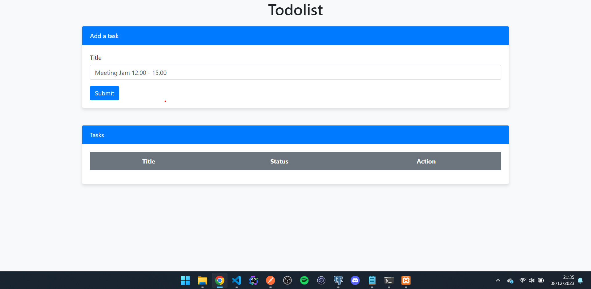
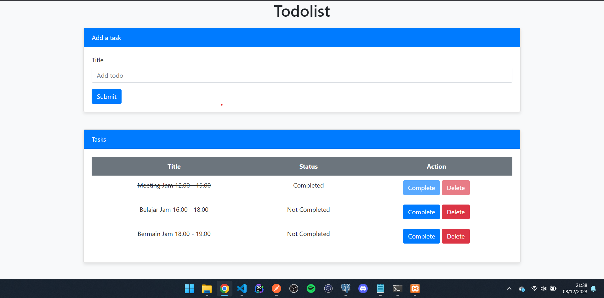

# Website Todolist

Ini adalah website Todolist, di web ini kita bisa melakukan seperti Menambah Todo, Complete Todo, dan menghapus Todo. Web ini juga sudah terintegrasi dengan database MYSQL

# Requirement

init `.env` file : `cp .env.example .env`

# Preview

### Routes Page :

### List Task Page Jika Complete dan Tidak :

# Sertifikat

- [Assistant Mentor](https://drive.google.com/file/d/1B2jwtE9Gb2rYU8gHFH60eaf2eAedv3JH/view?usp=sharing)
- [Assistant Mentor Recommendation Letter](https://drive.google.com/file/d/1cydxjYfefrtUPE1XASAHxEFc_jIrmNIh/view?usp=sharing)
- [Basic FE With HTML & CSS](https://img.rk-certificate.com/MUHAMMADUKQAGC3O/CERT-V62D480Z.jpg)
- [Basic Backend Programming](https://img.rk-certificate.com/MUHAMMADUKQAGC3O/CERT-ENJBR2NV.jpg)
- [Advanced Backend Programming](https://img.rk-certificate.com/MUHAMMADUKQAGC3O/CERT-T1DI6OWI.jpg)
- [Database Management](https://img.rk-certificate.com/MUHAMMADUKQAGC3O/CERT-DIZR47KZ.jpg)
- [Web Application](https://img.rk-certificate.com/MUHAMMADUKQAGC3O/CERT-S48K26HZ.jpg)
- [Dasar AWS Cloud](https://drive.google.com/file/d/1hp_CFxzI9hha7v0BcFmrXjLZKbf_vqWL/view?usp=sharing)
- [Dasar Pemrograman Web](https://drive.google.com/file/d/11vfFGYmBmJpfKMkCghiZuJUfS_ShGzbQ/view?usp=sharing)
- [Membuat Front-End Web untuk Pemula](https://drive.google.com/file/d/1KLi6uk79f2qW6hKHfu-ygyUXIoZr0mGv/view?usp=sharing)
- [HTML & CSS](https://drive.google.com/file/d/1FYmWwKzfOgsPLoXL2MladtgsnbyfA3dl/view?usp=sharing)
- [SQL](https://drive.google.com/file/d/11qQF21pusbxhm2d50RHfbzkYNJbMyGJH/view?usp=sharing)
- [Git](https://drive.google.com/file/d/1QmuRcHq7jX2TPqFa6qQg5OI_3N4wHeA4/view?usp=sharing)
- [Command Line](https://drive.google.com/file/d/1WAN9BxG1OoFVsKan1ztLNIDxnEms-Bi7/view?usp=sharing)
- [Path Pengembangan Web](https://drive.google.com/file/d/1ey2LaKGAxqdvOfvwoV3wqDBXRSGrYP9T/view?usp=sharing)
